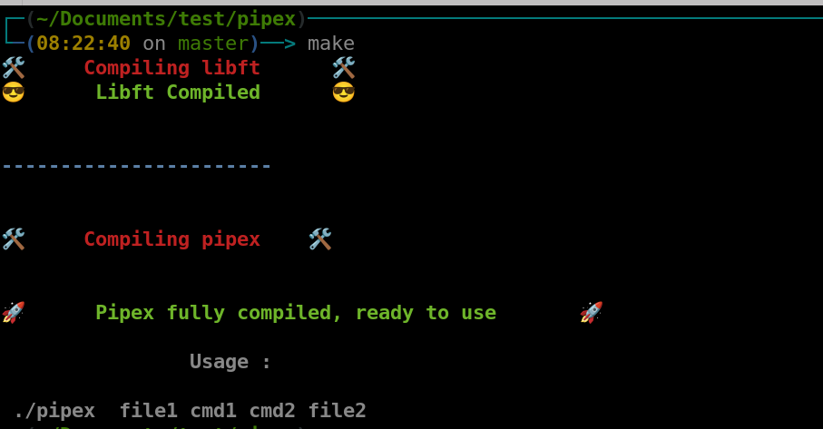
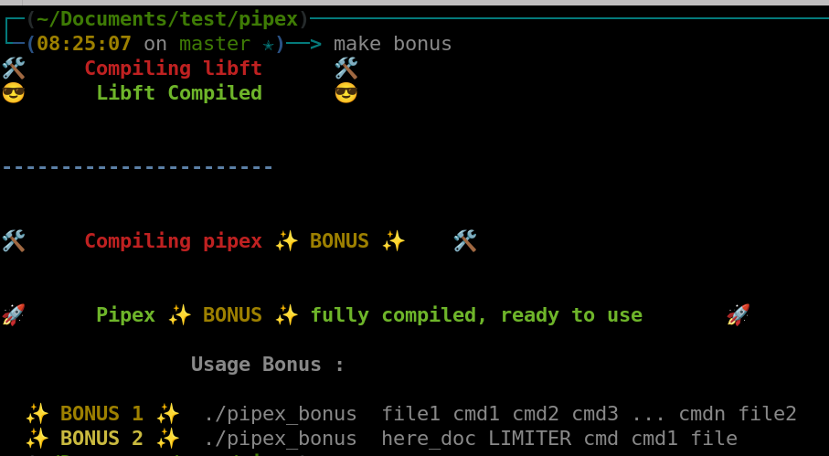

<p align="center">
  
</p>

## 🚀 SYNOPSIS

The `pipex` project at 42 school challenges students to craft a program emulating the intricacies of shell command pipelines in the C language.

This endeavor necessitates a deep comprehension of process creation, manipulation, and input/output redirection. Students are tasked with orchestrating a sequence of commands, efficiently directing the output of one command as the input for the next.

The project not only hones skills in managing processes but also delves into the nuances of handling file descriptors and executing commands in a seamless chain.

Successfully completing `pipex` showcases a mastery of process manipulation and solidifies the understanding of pivotal system calls in Unix-like operating systems.


## 🛠️ PROGRAM SPECIFICITIES AND CONSIDERATIONS

Clone the project :

```bash
git clone git@github.com:maitreverge/pipex.git && cd pipex
```

> [!IMPORTANT]
> The Makefile within this repo can produce 2 different binaries, which behaves differently.

> [!WARNING]
> The way the project is built means that `pipex` is expecting **COMMANDS AND OPTIONS** grouped in a single argument, surrounded with _"double-quotes"_.

The command :
```bash
./pipex infile.txt ls -l wc -l outfile.txt
```
will actually fail, because there is actually 6 arguments (without the binary).

The correct way to put is is :

```bash
./pipex infile.txt "ls -l" "wc -l" outfile.txt
```


## ⚙️ USAGE


### ✴️ PIPEX MANDATORY

The first binary is called `pipex`, and will be produced after executing :

```bash
make
````

<p align="center">
  
</p>

The first binary behaves like this :

```
./pipex file1 cmd1 cmd2 file2
```

which mimics the real shell command

```bash
< file1 cmd1 | cmd2 > file2
```

Examples :

```
./pipex infile.txt "ls -l" "wc -l" outfile.txt
```
### 💻 EXAMPLE

Let's make a basic example.
You'll need to create an `infile.txt` from which `pipex` will read in *`STD_IN`* :

```bash
echo "Hello, World\!" > infile.txt
```

Execute `pipex` :

```bash
./pipex infile.txt "cat" "rev" outfile.txt
```

This will create an outfile from which you can read :

```bash
cat outfile.txt
```

You should see the bellow result :

```text
!dlroW ,olleH
```

 
## ✴️ PIPEX BONUS

The second binary is called `pipex_bonus`, and will be produced after executing :

```bash
make bonus
````

<p align="center">
  
</p>

The second binary behaves in two different ways :

#### ◾ MULTIPES-BONUS

The multipipe take two or more commands :
```bash
./pipex_bonus  file1 cmd1 cmd2 cmd3 ... cmdn file2
```

which mimics the real bash command 

```bash
< file1 cmd1 | cmd2 | cmd3 ... | cmdn > file2
```

### 💻 EXAMPLE

```bash
./pipex_bonus  infile.txt cat rev "grep Hello" "wc -c" outfile.txt
```


#### ◾ HERE_DOC

> [!IMPORTANT]
> To trigger this bonus, the first argument **must** be `here_doc`.

The here_doc process take as a first argument **here_doc**, then two commands and a output file :

```bash
./pipex_bonus  here_doc LIMITER cmd cmd1 file
```

which mimics the real bash command 

```bash
cmd << LIMITER | cmd1 >> file2
```

> [!NOTE]
> In this bonus and only this one, the file descriptor of the output file is openned in **APPEND** mode.

### 💻 EXAMPLE

```bash
./pipex_bonus here_doc EOF cat rev outfile.txt
```

## 🤝 CONTRIBUTION
Contributions are open, make a pull request or open an issue 🚀
